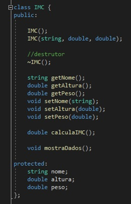
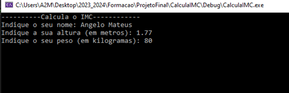
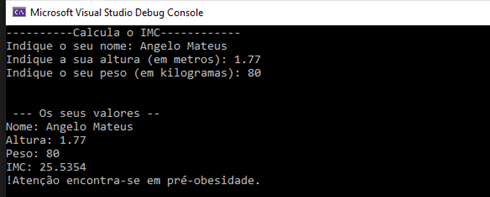

# GitHub_ProjetoFinal_AngeloMateus
## Projeto para aplicar após abordagem de classes em c++

*Projeto Realizado no ambito de formação Git GitHub - ANPRI
Formador: João Martiniano.*  
 

#### A Realizar:
- **A classe IMC deve permitir calcular o IMC e mostrar os resultados finais na consola.**
    - **Exemplo da classe IMC:**
IMC.h

 

- **Cria o código necessário no programa principal e no ficheiro ‘IMC.cpp’ de modo a pedires ao utilizador o nome, a altura e o peso.**

    -Exemplo pedido de dados:

 

- **Após os dados inseridos pelo utilizador apresenta os seus valores de IMC (formula: IMC=peso/altura2). Tem em conta os seguintes dados:**
    - Magreza, quando o resultado é menor que 18.5 kg/m2;
    - Normal, quando o resultado está entre 18.5 e 24.9 kg/m2;
    - Pré-obesidade, quando o resultado está entre 25 e 29.9 kg/m2;
    - Obesidade grau I, quando o resultado está entre 30 e 34.9 kg/m2.
    - Obesidade grau II, quando o resultado está entre 35 e 39.9 kg/m2.
    - Obesidade grau III, quando o resultado e maior ou igual a 40 kg/m2.
-Exemplo mostra de dados:

